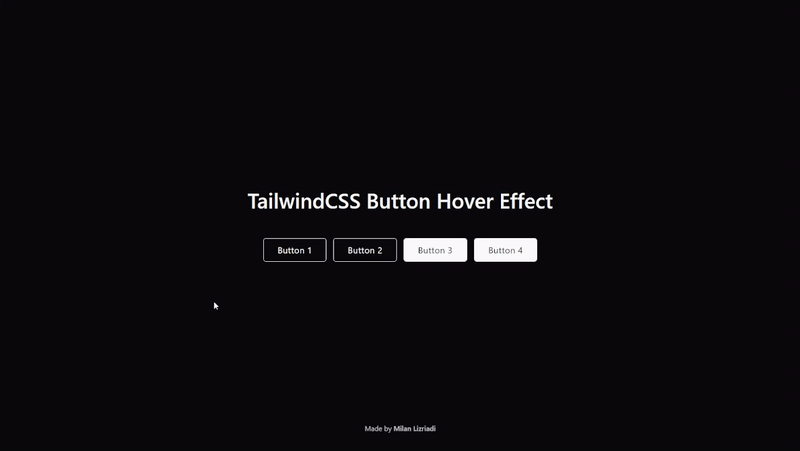

# TailwindCSS Button Hover Effect

Made by Milan Lizriadi

<br>

## Instalation

### You can either clone the repository

```bash
git clone https://github.com/milanlizriadi/tailwindcss-button.git
```

<br>

### Install the Packages

```bash
npm i
```

### Setup TailwindCSS

```bash
npx tailwindcss -i ./src/input.css -o ./src/output.css --watch
```

<hr>

### ...or Copy/Download the File

<br>
<a href="src/input.css">Download The File Here</a>

<br>
<hr>
<br>

# Usage

You can either use `<button>` or `<a>` tag then put class `button` on it. <br> Examples:

```html
<button href="#" class="button">Button</button>
<a href="#" class="button">Button</a>
```

<br>

Then you can pick what style do you want:

```html
<button href="#" class="button button1">Button</button>
<button href="#" class="button button2">Button</button>
<button href="#" class="button button3">Button</button>
<button href="#" class="button button4">Button</button>
```

<br>

# Preview:



## ..or try it yourself:
<br>
<a href="https://tailwindcss-button-hover-effect.vercel.app/">Demo</a>

<br>
<hr>
<br>

Made by <b>Milan Lizriadi.</b>

© Milan Lizriadi 2024.
